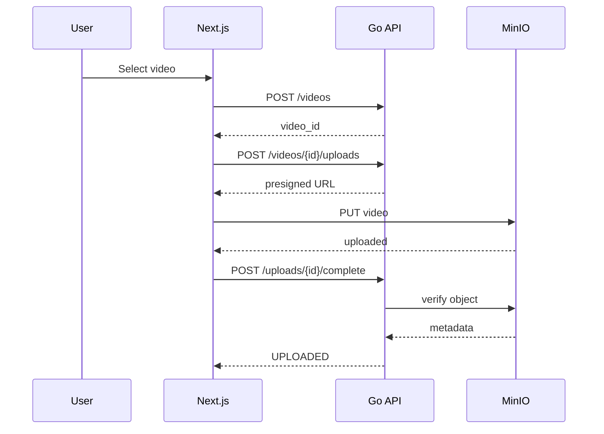
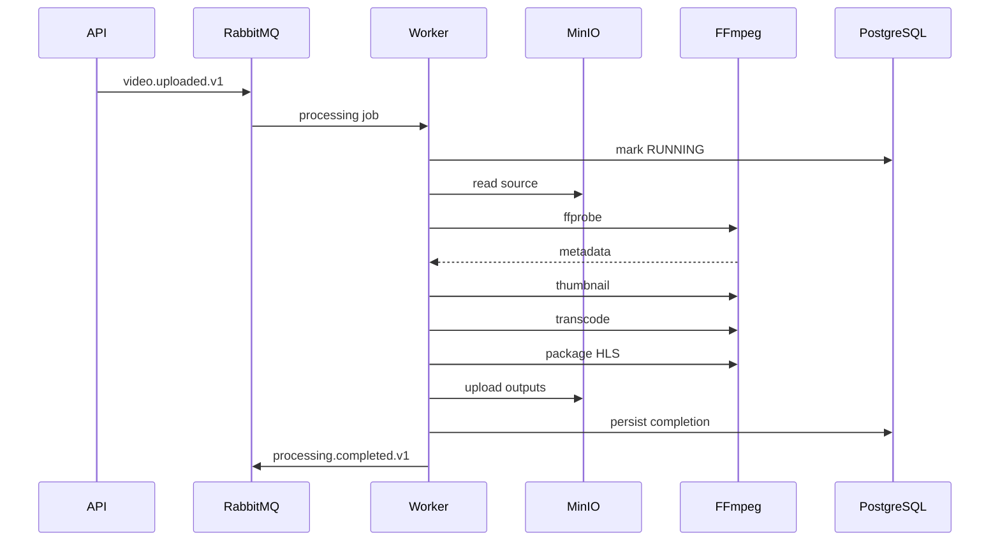
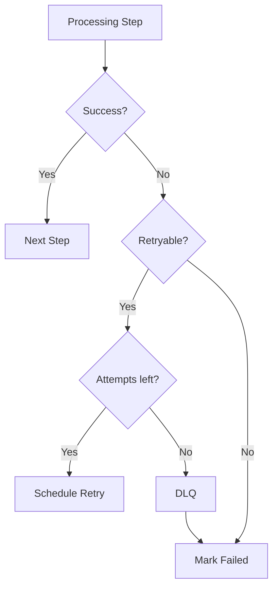

# Processing Flow

## 1. Happy path

```text
User
↓
Create Video
↓
Create Upload Session
↓
Upload MinIO
↓
Confirm Upload
↓
video.uploaded.v1
↓
Processing Job
↓
Worker
↓
ffprobe
↓
Thumbnail
↓
Rendition Planning
↓
Transcode
↓
HLS
↓
Upload Outputs
↓
processing.completed.v1
↓
READY
↓
Playback
```

## 2. Upload sequence



## 3. Processing sequence



## 4. Pipeline

```text
ValidateSource
↓
ExtractMetadata
↓
GenerateThumbnail
↓
PlanRenditions
↓
TranscodeRenditions
↓
PackageHLS
↓
PersistAssets
↓
CompleteProcessing
```

## 5. ValidateSource

Check:
- source tồn tại
- đọc được
- size hợp lệ

Errors:
```text
SOURCE_NOT_FOUND
SOURCE_UNREADABLE
```

## 6. ExtractMetadata

Dùng `ffprobe`.

Required:
```text
duration
width
height
video codec
container
```

Optional:
```text
audio codec
frame rate
bitrate
```

## 7. Thumbnail

MVP generate một thumbnail ở khoảng 10% duration với guard cho video quá ngắn.

## 8. Rendition Planning

Target:
```text
360p
720p
1080p
```

Rules:
- không upscale
- giữ aspect ratio
- portrait vẫn portrait

## 9. Transcode

Initial output:
```text
H.264 video
AAC audio
```

Encoding profile nằm trong config.

## 10. HLS

Generate:
- master playlist
- variant playlists
- segments

Logical playback asset:
```text
HLS_MASTER
```

## 11. Failure flow



## 12. Worker crash

```text
worker nhận message
↓
FFmpeg đang chạy
↓
worker chết
```

Expected:
```text
message không mất vĩnh viễn
↓
redelivery/recovery
↓
idempotency check
↓
restart stage an toàn
```

MVP không cần resume FFmpeg giữa file.

## 13. Duplicate message

```text
message A
message A lần nữa
```

Expected:
```text
same operation_key
↓
unique constraint/state check
↓
one logical result
```

## 14. Temporary processing directory

```text
/tmp/video-processing/{job_id}
```

Lifecycle:
```text
create
↓
download source
↓
FFmpeg
↓
upload outputs
↓
cleanup
```

## 15. Delete flow

```text
DELETE video
↓
DELETING
↓
enqueue cleanup
↓
delete source
↓
delete outputs
↓
DELETED
```

## 16. Progress

MVP dùng stage progress:
```text
UPLOADING
METADATA
THUMBNAIL
TRANSCODING
PACKAGING
READY
```

## 17. Simplification đầu tiên

Version đầu:
```text
one processing job
one worker pipeline
sequential stages
```

Sau khi ổn mới:
```text
fan-out rendition jobs
parallel workers
fan-in packaging
```

Không bắt đầu bằng workflow DAG phức tạp.
